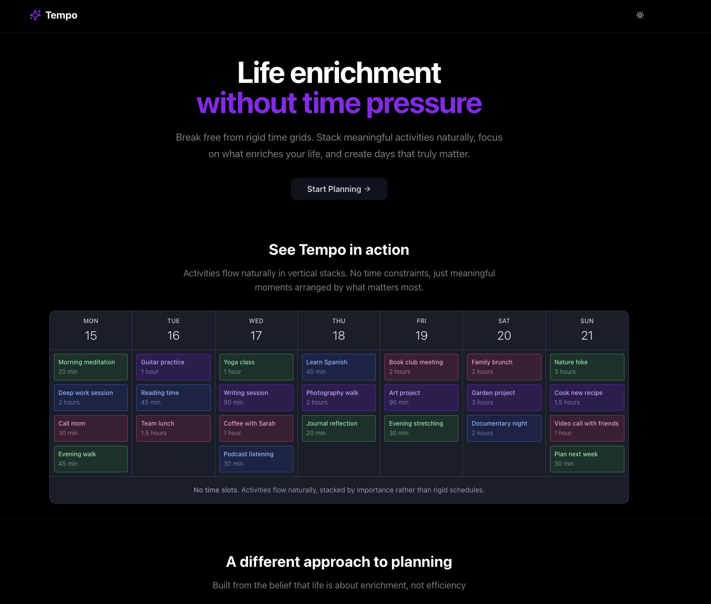

# Tempo

## Life enrichment without time pressure

Break free from rigid time grids. Stack meaningful activities naturally, focus on what enriches your life, and create days that truly matter.

## See Tempo in action

Activities flow naturally in vertical stacks. No time constraints, just meaningful moments arranged by what matters most.



**No time slots.** Activities flow naturally, stacked by importance rather than rigid schedules.

## A different approach to planning

Built from the belief that life is about enrichment, not efficiency.

## Key Features

- **Time-free planning**: Stack activities by importance, not rigid schedules
- **Life enrichment focus**: Four meaningful categories - Enrichment, Connection, Growth, Creative
- **Intuitive drag & drop**: Effortlessly move activities between days
- **Activity completion tracking**: Mark activities as done with visual progress
- **Streak visualization**: See your consistency patterns over time
- **Focus mode**: Distraction-free daily view for getting things done
- **Multiple calendar views**: Default, Groups, Stacks, and Bubbles for different perspectives
- **Day templates**: Save and reuse weekly patterns
- **Dark mode**: Beautiful interface that works day and night

## Tech Stack

- **Next.js 15.3.3** - React framework with App Router
- **TypeScript** - Type-safe development
- **Tailwind CSS v4** - Utility-first styling
- **@dnd-kit** - Accessible drag and drop
- **SQLite + Drizzle ORM** - Local database with type-safe queries
- **date-fns** - Modern date utilities
- **Lucide Icons** - Beautiful, consistent iconography

## Getting Started

### Prerequisites

- Node.js 18+ 
- pnpm (recommended) or npm

### Installation

```bash
# Clone the repository
git clone [your-repo-url]
cd tempo

# Install dependencies
pnpm install

# Run the development server
pnpm dev
```

Open [http://localhost:3000](http://localhost:3000) to see the app.

### Building for Production

```bash
pnpm build
pnpm start
```

## Project Structure

```
tempo/
├── app/                          # Next.js app directory
│   ├── tempo/                    # Main app routes
│   │   ├── page.tsx             # Weekly calendar view
│   │   ├── day/[date]/          # Daily views
│   │   │   ├── page.tsx         # Day editor
│   │   │   └── focus/page.tsx   # Focus mode
│   │   └── streaks/             # Activity tracking
│   │       ├── page.tsx         # All streaks overview
│   │       └── [activity]/page.tsx # Individual activity streaks
├── components/tempo/             # Core components
│   ├── TempoCalendar.tsx        # Main calendar container
│   ├── ActivityBlock.tsx        # Draggable activity cards
│   ├── DayColumn.tsx            # Day view components
│   ├── Experimental*.tsx        # Alternative calendar views
│   └── ActivityEditor.tsx       # Activity creation modal
├── hooks/
│   ├── useTempoStorageAPI.ts    # Database operations
│   └── useDayTemplatesDB.ts     # Template management
├── lib/
│   ├── db/                      # Database layer
│   │   ├── schema.ts           # SQLite schema definitions
│   │   └── services.ts         # Database services
│   ├── types.ts                # TypeScript definitions
│   └── utils/                  # Utility functions
└── mcp-server/                 # Model Context Protocol server
```

## Design Philosophy

Tempo embraces a "less is more" approach:

- **Minimal cognitive load**: No time slots to worry about
- **Visual clarity**: Clean interface that doesn't compete for attention
- **Meaningful defaults**: Four activity types that cover most personal goals
- **Playful touches**: Subtle personality without sacrificing professionalism

## Activity Types

- 🎯 **Enrichment** (blue): Learning, reading, skill development
- 💝 **Connection** (pink): Social activities, quality time with others
- 🌱 **Growth** (green): Exercise, meditation, self-improvement
- 🎨 **Creative** (purple): Art, music, creative projects

## Contributing

Feel free to open issues or submit pull requests. Please follow the existing code style and design principles.

## License

[Your chosen license]

---

Built with ♥ to help you focus on what matters